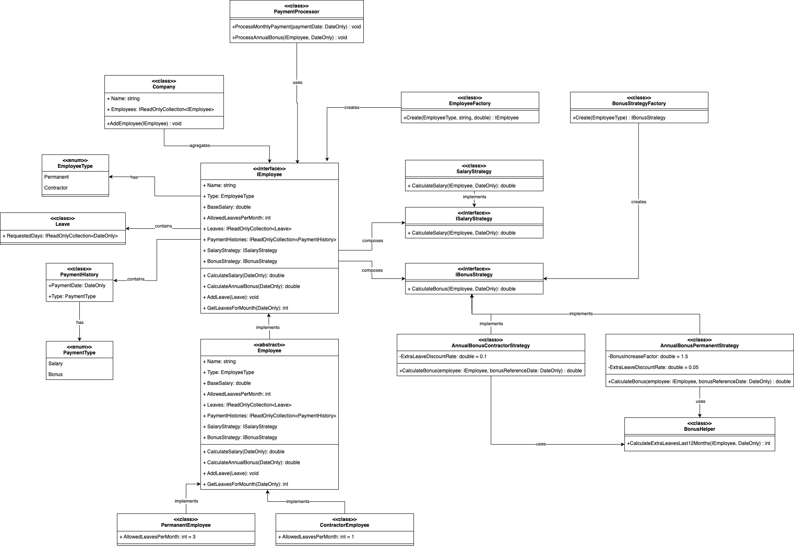

# Payroll System

The Payroll System is C# application that handles employee salary, leaves, and bonus calculations in a simple way just to show how I design the domain's solution

## Functional Requirements
- The system need support two types of employees:
  - Permanent
  - Contractor.
- The system need to calculate the monthly salary for an employee based on:
  - The employee's base salary.
  - The number of leave days taken in the payment month.
  - The allowed number of leave days:
    - 3 for Permanent employees.
    - 1 for Contractor employees.
  - A proportional deduction based on the number of extra leave days
- The system need to calculate an annual bonus for each employee based on:
  - The employee’s base salary + multiplier.
  - The number of extra leave days taken over the last 12 months.
  - Different calculation rules for Permanent and Contractor employees.  

## Usage Instructions
### Prerequisites
- .NET 8.0 SDK or later

### Installation

1. Clone the repository:
```bash
git clone https://gitlab.com/dotnet961011/irh.git
cd payroll-management-system
```

2. Restore dependencies:
```bash
dotnet restore
```

3. Build the project:
```bash
dotnet build
```

# Class Diagram

